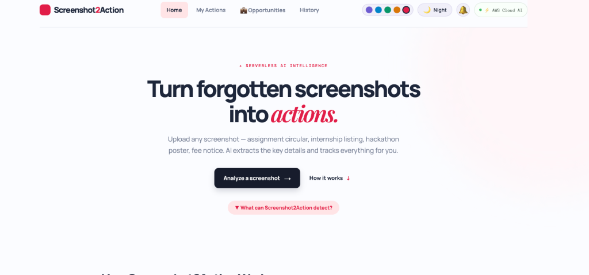
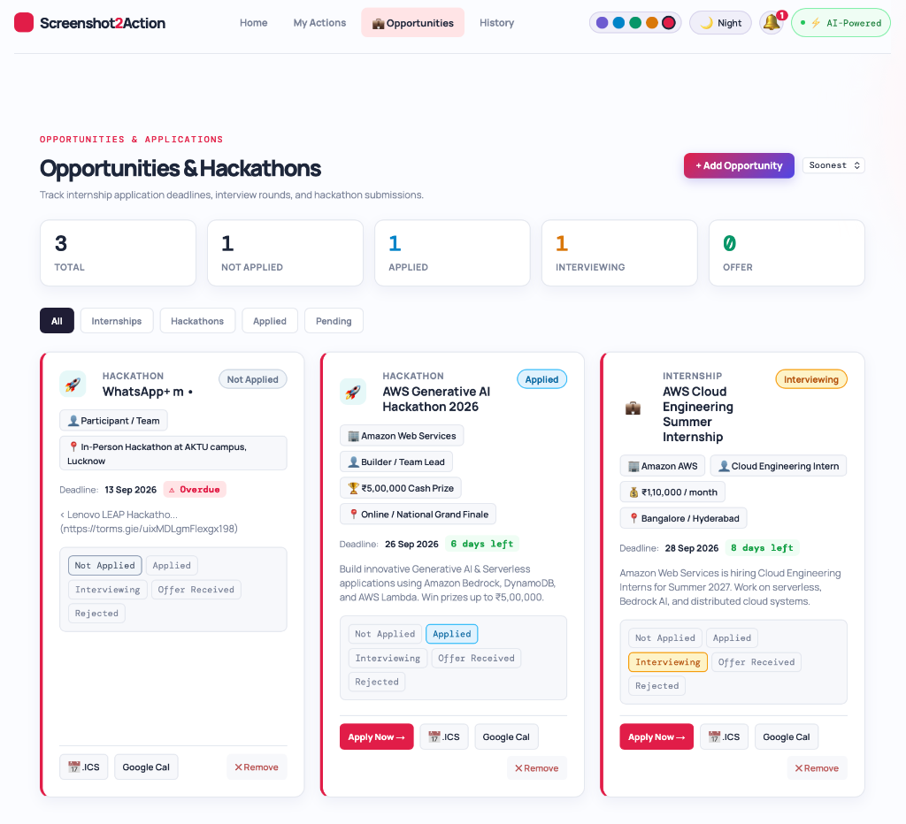
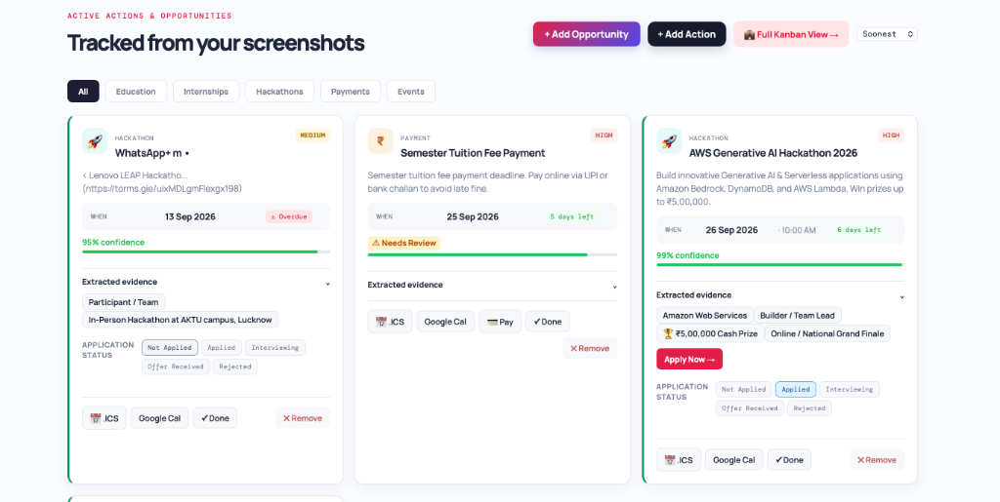
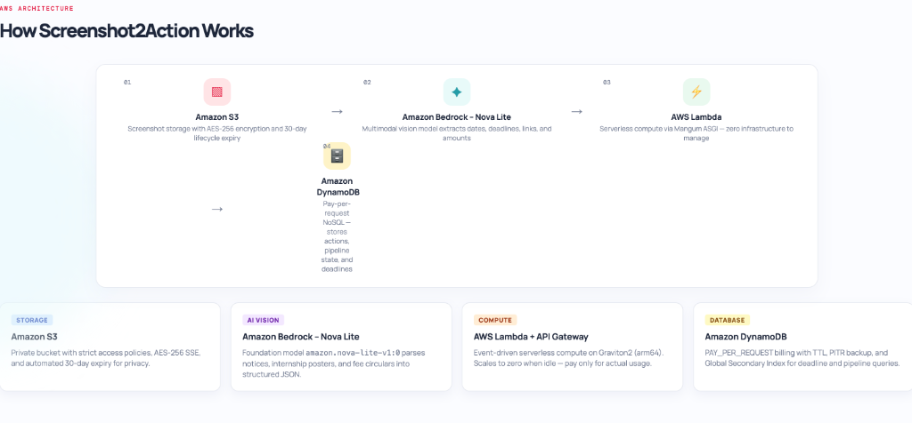

# Screenshot2Action ↗

> **Turn forgotten screenshots into organized actions, tracked opportunities, and calendar events.**  
> **Submission Track:** AWS First Commit 2026 — **BUILD IT (Local Working Demo & Target Serverless Architecture)**

[](https://github.com/Lax59/screenshot2action)
[](https://aws.amazon.com/bedrock/)
[](https://fastapi.tiangolo.com)
[](template.yaml)
[](LICENSE)

---

> [!IMPORTANT]
> **Build It / Local Demo Submission Notice:**
> - **Fully Working Demo:** The primary, fully functional demonstration runs locally via **`localhost`** (React frontend on port 5173 + FastAPI backend on port 8000).
> - **Netlify URL:** The Netlify deployment is a static frontend preview only and does not connect to a live backend.
> - **AWS Cloud Status:** Cloud resources (Amazon Bedrock, AWS Lambda, Amazon S3, and Amazon DynamoDB) are **not currently deployed live**. They are fully specified, verified, and ready in our open-source **AWS SAM (`template.yaml`)** for deployment via `sam deploy`.
> - **Parser Execution:** The local demo uses a resilient local NLP-based extraction engine that mirrors the exact JSON schema defined for Amazon Bedrock Nova Lite.

---

## 🎯 The Problem

Students and developers capture dozens of screenshots every month:
- WhatsApp assignment deadlines and exam circulars
- LinkedIn and hiring notices for summer/winter internships
- Hackathon posters with registration dates and prize pools
- Semester tuition fee receipts and payment challans

These screenshots get buried in photo galleries. Critical submission deadlines pass, job openings close, and late payment fines accumulate because there is no automated bridge between image captures and structured task execution.

---

## 💡 The Solution

**Screenshot2Action** is an intelligent fullstack application designed to convert visual clutter into structured momentum:

1. **Academic Deadlines** — Title, submission cutoff date, course, priority, and extracted evidence quote.
2. **Opportunities & Hackathons** — Program name, company, role track, stipend/prize pool, application portal URL, and deadline.
3. **Payments & Fees** — Due amount in ₹ INR, target UPI ID (`upi://pay`), and warning flags.
4. **Calendar & Pipeline Integration** — One-click `.ICS` file download (Apple Calendar / Outlook), Google Calendar deep link, and an interactive Kanban application status pipeline.

---

## 🏗 Target AWS Serverless Architecture (SAM)

The project includes a complete, validated **AWS SAM (`template.yaml`)** specifying an event-driven serverless architecture:

```
User Browser (React + Vite)
    │
    ├─► Amazon S3 (Screenshot storage, AES-256 server-side encryption, 30-day lifecycle expiration)
    │
    ├─► Amazon API Gateway (HTTP API with CORS)
    │     │
    │     ▼
    │   AWS Lambda (Python 3.13, Graviton2 arm64)
    │     │   ├── FastAPI via Mangum ASGI adapter
    │     │   └── boto3 client
    │     │
    │     ├─► Amazon Bedrock (Nova Lite: amazon.nova-lite-v1:0)
    │     │     Multimodal foundation vision model
    │     │
    │     └─► Amazon DynamoDB (PAY_PER_REQUEST, actions table)
    │           Action CRUD, application pipeline states, TTL
```

### AWS Services Breakdown (Target Architecture)
| AWS Service | Role | Configuration | Status in Submission |
|---|---|---|---|
| **Amazon Bedrock** | Multimodal Vision AI | Model ID: `amazon.nova-lite-v1:0` with JSON schema prompt | Architected in code; local demo uses schema-matching local parser |
| **AWS Lambda** | Serverless Backend Compute | Python 3.13 on `arm64` (Graviton2) with Mangum ASGI handler | Configured in `template.yaml`; run locally via FastAPI/Uvicorn |
| **Amazon API Gateway** | Managed HTTP API | CORS-enabled, low-latency REST routing | Defined in `template.yaml` (HTTP API) |
| **Amazon S3** | Secure Image Storage | `PublicAccessBlockConfiguration: true`, AES-256 SSE, 30-day TTL | Defined in `template.yaml`; local fallback saves to local directory |
| **Amazon DynamoDB** | NoSQL Data Store | `BillingMode: PAY_PER_REQUEST`, Point-in-Time Recovery enabled | Defined in `template.yaml`; local demo stores in JSON persistence layer |
| **AWS SAM** | Infrastructure as Code | Complete single-command deployment via `template.yaml` | Validated (`sam validate`) and ready for `sam deploy` |

---

## ✨ Working Features (Local Demo)

- **✦ Intelligent Extraction**: Upload circulars or click demo samples to extract titles, dates, currency amounts, and application URLs.
- **💼 Opportunities Tracker (Kanban Pipeline)**: Track internship and hackathon applications through 5 stages: *Not Applied*, *Applied*, *Interviewing*, *Offer Received*, and *Rejected*.
- **✨ Universal Manual Entry Modal**: Add opportunities or academic tasks manually with category-specific fields without needing an image.
- **📅 Calendar Deep-Links & .ICS**: Download standardized `.ics` calendar events with built-in 30-minute reminder alarms or pre-fill Google Calendar.
- **💳 Instant UPI Pay Integration**: Parses UPI IDs and bill amounts to launch Google Pay, PhonePe, or Paytm via `upi://pay` links.
- **🌓 Theme & Color Accents**: Fully responsive Day/Night modes and 5 accent palettes (Violet, Cyan, Emerald, Amber, Rose).
- **🔔 Notification Bell**: In-app deadline alerts highlight upcoming or overdue items.

---

## 📁 Repository Structure

```
screenshot2action/
├── src/
│   ├── main.jsx          # React 18 single-page application (Dashboard, Kanban, Upload)
│   └── styles.css        # Responsive stylesheet (Day/Night themes, cards, modals)
├── backend/
│   ├── main.py           # FastAPI backend (Bedrock client, S3/DynamoDB CRUD, fallback parser)
│   ├── actions_store.json # Persistent JSON data store for local development
│   └── requirements.txt  # Python dependencies (fastapi, uvicorn, boto3, mangum)
├── template.yaml         # AWS SAM CloudFormation template (Lambda, S3, DynamoDB, HTTP API)
├── Dockerfile            # Container deployment manifest for backend
├── Procfile              # PaaS process file (Render / Heroku)
├── render.yaml           # One-click Render.com deployment blueprint
├── netlify.toml          # Netlify build configuration
├── index.html            # Vite HTML entrypoint
└── package.json          # Node.js dependencies (React, Vite)
```

---

## 🚀 Quick Start (Running the Local Demo)

### 1. Prerequisites
- **Node.js** v18+ and **npm**
- **Python** 3.11+ (Python 3.13 recommended)

### 2. Frontend Setup
```bash
# Clone the repository
git clone https://github.com/Lax59/screenshot2action.git
cd screenshot2action

# Install frontend dependencies and start Vite dev server
npm install
npm run dev
```
The frontend is available at `http://localhost:5173`.

### 3. Backend Setup
```bash
# In the project root directory
python3 -m venv backend/.venv
source backend/.venv/bin/activate
pip install -r backend/requirements.txt

# Start the FastAPI server
uvicorn backend.main:app --host 127.0.0.1 --port 8000 --reload
```
The API is available at `http://localhost:8000`. Test health at `http://localhost:8000/api/health`.

---

## ☁️ Deploying to AWS (When Ready)

Once AWS credentials and Amazon Bedrock model access (`amazon.nova-lite-v1:0`) are configured:

```bash
# 1. Configure AWS CLI
aws configure

# 2. Build and deploy with SAM
sam build --region ap-south-1
sam deploy --guided
```

---

## 🧪 Testing the API

Run the test suite to verify health, actions CRUD, and demo screenshot analysis:

```bash
python3 - << 'EOF'
import urllib.request, json

base = "http://127.0.0.1:8000"

# 1. Health check
with urllib.request.urlopen(f"{base}/api/health") as r:
    print("Health:", json.loads(r.read()))

# 2. Get actions
with urllib.request.urlopen(f"{base}/api/actions") as r:
    actions = json.loads(r.read())
    print(f"Loaded {len(actions)} actions successfully.")
EOF
```

---

## 📸 Application Interface & Feature Showcase

### 1. Hero & Screenshot Analysis Inbox

*Upload circulars, assignment notices, or hackathon flyers. The system extracts dates, urgency levels, and actions with zero manual data entry.*

### 2. Opportunities & Hackathon Pipeline

*Track internship applications and hackathon registrations across a 5-stage pipeline: Not Applied, Applied, Interviewing, Offer, and Rejected.*

### 3. Tracked Actions & Instant Integrations

*Action items extracted from screenshots with urgency indicators, one-click `.ICS` calendar export, Google Calendar sync, and instant `upi://pay` links.*

### 4. AWS Serverless Architecture

*Visual architectural flow showing Amazon S3, Amazon Bedrock (Nova Lite), AWS Lambda, and Amazon DynamoDB working as the target serverless design.*

---

## 📄 License

Distributed under the MIT License. See `LICENSE` for more information.
